## Halo! Selamat datang di website milik DREAM Entertainment khusus untuk Project Web Programming 2023.

### Anggota Kelompok:
<ul>
<li>2440094352 - Devin Augustin <strong>(UI/UX Designer, Documentations)</strong></li>
<li>2440114373 - Rico Frenaldi T. <strong>(UI/UX Designer - Figma)</strong></li>
<li>2440067175 - Ariel Sefrian <strong>(Programmer)</strong></li>
</ul>

### Visi:
Melepaskan Kekuatan K-Pop di Seluruh Dunia

### Misi:
<ol>
<li>
Merayakan Keunggulan K-Pop: Misi kami adalah menyediakan platform yang merayakan keunggulan artis K-Pop, musik mereka, dan penampilan mereka. Kami bertujuan untuk menampilkan beragam bakat dan hiburan menawan yang ditawarkan K-Pop.
</li>

 

<li>
Keterlibatan Global: Kami berusaha untuk menghubungkan penggemar K-Pop dari seluruh dunia dengan memberikan konten berkualitas tinggi, memupuk rasa kebersamaan, dan mempromosikan pertukaran lintas budaya. Melalui platform kami, kami bertujuan untuk menjembatani kesenjangan antara artis K-Pop dan basis penggemar internasional mereka.
</li>

 

<li>
Menemukan Bakat Baru: Kami berdedikasi untuk mencari dan memelihara bakat K-Pop yang muncul, memberi mereka panduan, sumber daya, dan peluang yang diperlukan untuk bersinar di industri yang sangat kompetitif. Kami bertujuan untuk menjadi katalis untuk menemukan superstar K-Pop generasi berikutnya.
</li>

 

<li>
Meningkatkan Pengalaman Penggemar: Misi kami adalah menciptakan pengalaman tak terlupakan bagi penggemar K-Pop dengan menyelenggarakan acara interaktif, konser, dan pertemuan penggemar. Kami bertujuan untuk menumbuhkan lingkungan yang menarik dan imersif yang memungkinkan penggemar terhubung dengan artis favorit mereka dan sesama penggemar.
</li>

 

<li>
Mempromosikan Pertukaran Budaya: Kami percaya pada kekuatan K-Pop untuk melampaui batas dan mempromosikan pemahaman budaya. Melalui kolaborasi, kemitraan, dan inisiatif filantropis, kami bertujuan untuk berkontribusi pada apresiasi dan pengakuan global terhadap budaya Korea.
</li>
</ol>

### Feature Overview
<ol>
<li>
<strong>Log In</strong>
 
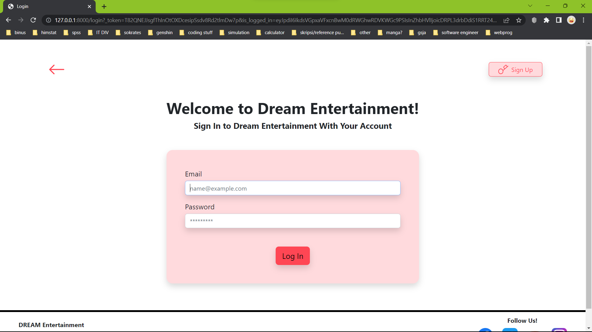
</li>

 

<li>
<strong>Sign Up</strong>
 
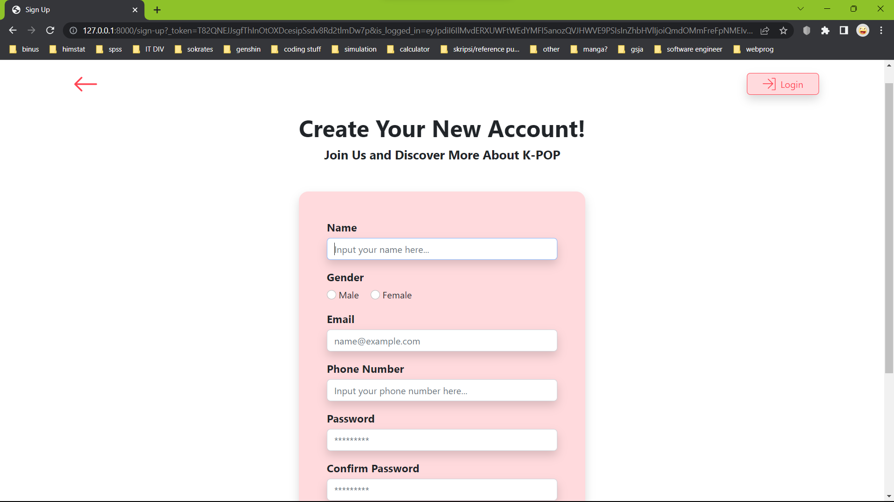
</li>

 

<li>
<strong>Home</strong>
 
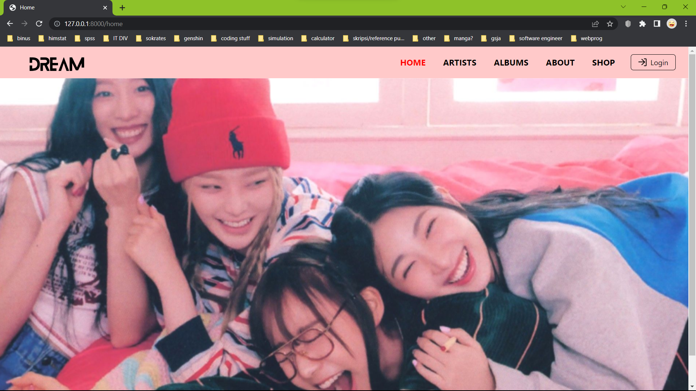
</li>

 

<li>
<strong>List Artist</strong>
 
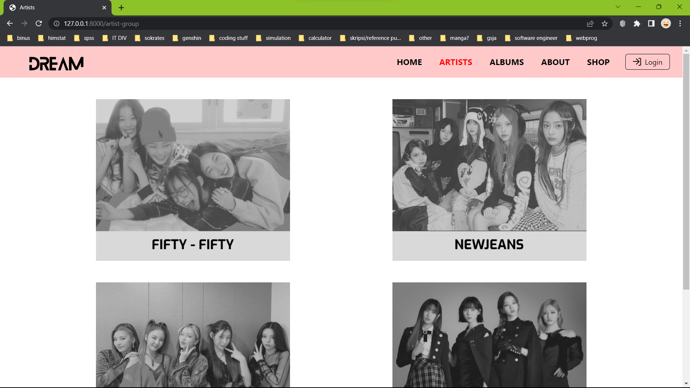
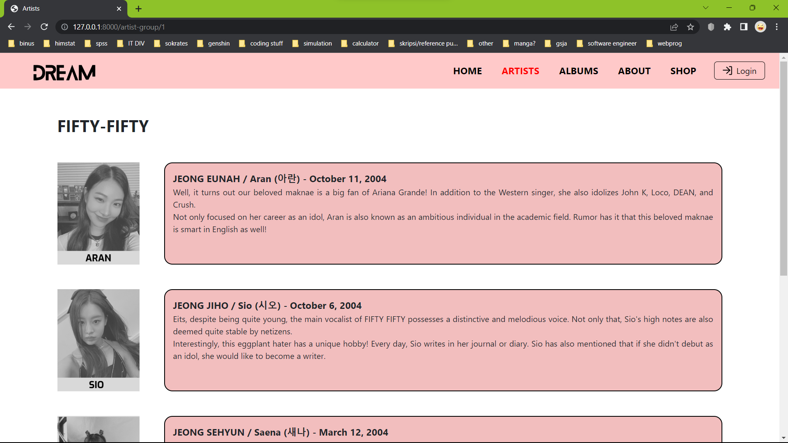
</li>

 

<li>
<strong>List Album dan Track</strong>
 
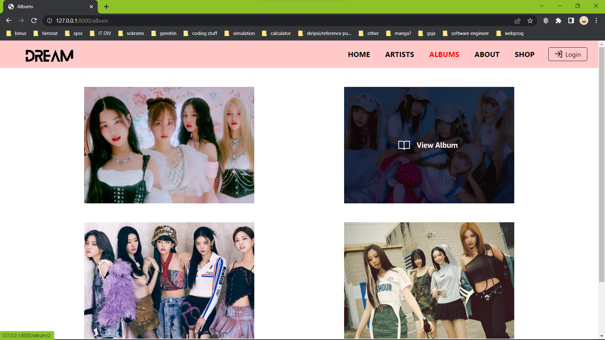
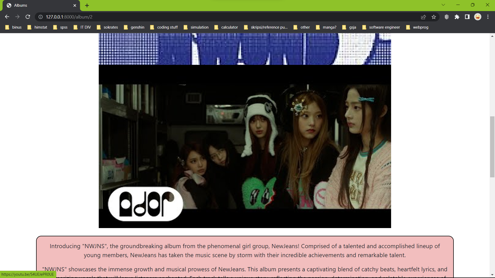
</li>

 

<li>
<strong>About Us</strong>
 
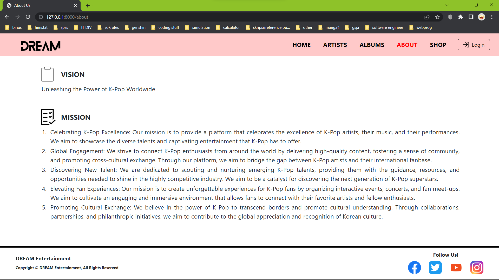
</li>

 

<li>
<strong>Shop</strong>
 
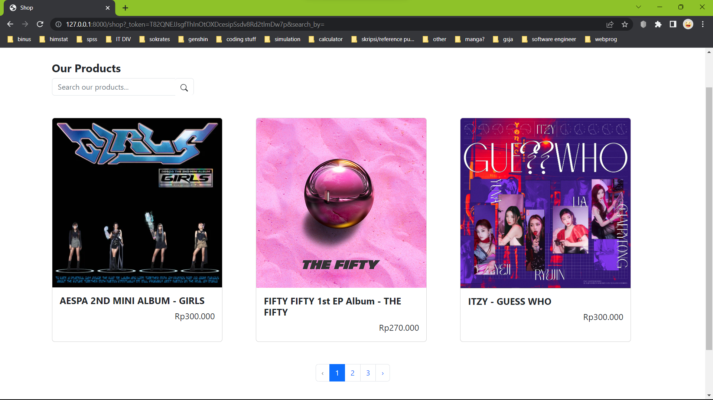
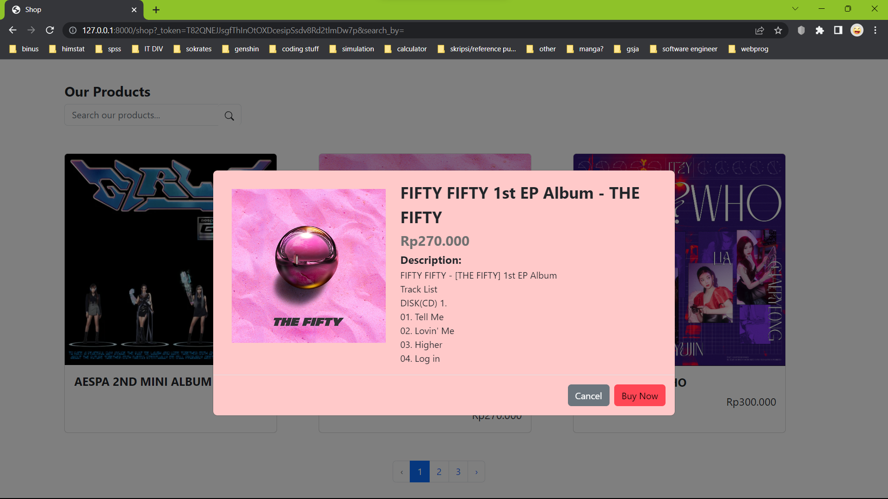
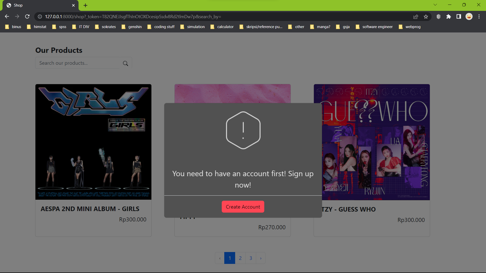
</li>

 

<li>
<strong>User Profile</strong>
 
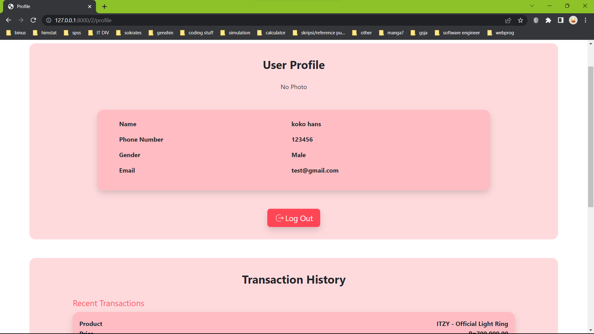
</li>

 

<li>
<strong>Transaction History</strong>
 
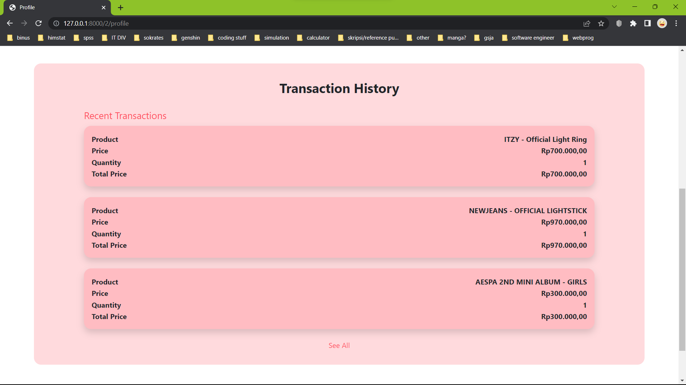
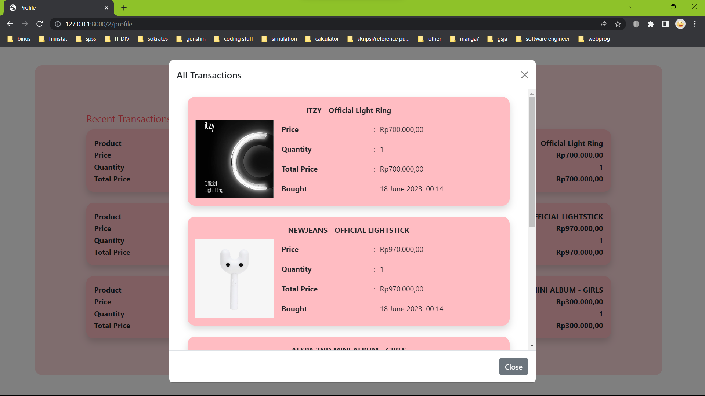
</li>
</ol>

### Link-Link Penting:
<ul>
<li>
<strong>Figma</strong>: https://www.figma.com/file/lf4ZC9ePmtFVQx3kolomNH/PROJECT-WP?type=design&node-id=17%3A245&t=jbvZ7APijHrvSFy7-1
</li>
<li>
<strong>Pitch Deck (Notion)</strong>: https://relic-suggestion-b8c.notion.site/Pitch-Deck-Dream-Entertainment-297438c8b57547d8994b17604dddae0d
</li>
</ul>

### Cara setup aplikasi:
<ol>
<li>
Pastikan Anda berada di branch production
</li>

 

<li>
Jalankan `git clone https://github.com/whisper034/webprog-entertainment-group-3.git` di terminal, atau download zipnya
</li>

 

<li>
Jalankan `composer install`
</li>

 

<li>
Copy file `.env.example`, kemudian paste di folder projectnya dan hapus `.example`, sehingga hanya tersisa `.env`
</li>

 

<li>
Apabila file `.env` sudah ada, jalankan `php artisan key:generate` di terminal
</li>

 

<li>
Setelah itu, jalankan `php artisan cache:clear` dan `php artisan config:clear` di terminal
</li>

 

<li>
Buka XAMPP, nyalakan Apache dan MySQL
</li>

 

<li>
Pada MySQL, klik Admin.
</li>

 

<li>
Anda akan di-direct ke halaman local phpMyAdmin. Di halaman itu, buat database baru dengan nama <strong>webprog_entertainment_group_3</strong> supaya sama dengan yang di dalam .env
</li>

 

<li>
Kemudian jalankan `php artisan migrate:fresh --seed` di terminal, tunggu sampai selesai migrate
</li>

 

<li>
Jalankan `php artisan serve`.
</li>

 

<li>
Navigasi ke localhost yang digenerate oleh `php artisan serve`, Anda akan di-direct ke halaman HOME.
</li>
</ol>

### Copyright &copy; --- DREAM Entertainment
